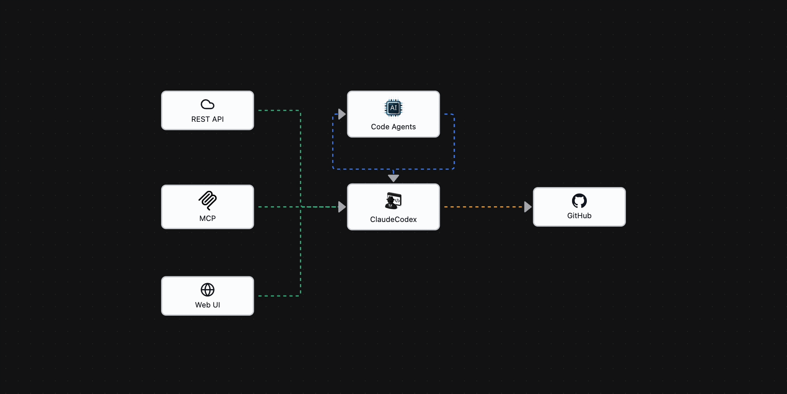

   [](LICENSE) 

# ClaudeCodex



ClaudeCodex is the first open-source project that turns the most powerful code agents, such as ANTHROPIC ClaudeCode and OpenAI Codex into background agents, accessible via REST API, MCP, and an interactive frontend

## ✨ Features

   

## Getting Started

### Quick Start (Recommended)


The fastest way to get ClaudeCodex running is with our pre-built Docker image:


**GitHub Authentication (Choose one method):**

**Option 1: Direct Token**
```bash
docker run -e GITHUB_TOKEN=[ghp_xxx] \
           -e API_KEY=[sk-...-xxx] \ # Optional
           claudecodex/claudecodex:v1.0.1-alpha
```


**Option 2: OAuth Flow**

```bash

docker run -e GITHUB_CLIENT_ID=[your_client_id] \
           -e GITHUB_CLIENT_SECRET=[your_client_secret] \
           -e GITHUB_REDIRECT_URI=http://localhost:3000 \
           -e API_KEY=[sk-...-xxx] \ # Optional 
           claudecodex/claudecodex:v1.0.1-alpha
```

**Optional Environment Variables:**
- `API_KEY`: Your Anthropic Claude or OpenAI API key (auto-detects provider)
- `GITHUB_TOKEN`: GitHub access token (alternative to providing it in requests)

**🤖 Supported AI Models:**
- **Anthropic**: claude-sonnet-4-20250514 (default), claude-opus-4-20250514, claude-3-7-sonnet-20250219
- **OpenAI**: codex-mini-latest (default), o4-mini

### Production

#### Prerequisites


#### With Docker Compose (Recommended)

1.  **Clone the repository:**

    ```bash
    git clone https://github.com/michael-elkabetz/claudecodex.git
    cd claudecodex
    ```

2.  **Set up environment variables:**

    Update `docker-compose.yml` with the following environment variables:

    ```bash
    VITE_GITHUB_CLIENT_ID=[VITE_GITHUB_CLIENT_ID]
    VITE_GITHUB_REDIRECT_URI=[VITE_GITHUB_REDIRECT_URI]
    GITHUB_CLIENT_SECRET=[GITHUB_CLIENT_SECRET]
    GITHUB_TOKEN=ghp_xxx
    API_KEY=[your_anthropic_or_openai_api_key]  # Optional
    ```

3.  **Deploy with Docker Compose:**

    ```bash
    # Build and start all services
    docker-compose up --build -d
    
    # View logs
    docker-compose logs -f
    ```

4.  **Access the services:**
    - **Frontend**: http://localhost (port 80)
    - **Backend API**: http://localhost:3000
    - **MCP Server**: http://localhost:6213

#### With Docker (Frontend + Backend)

1.  **Clone the repository:**

    ```bash
    git clone https://github.com/michael-elkabetz/claudecodex.git
    cd claudecodex
    ```

2.  **Set up environment variables:**

    Update the main `Dockerfile` with the following environment variables:

    ```bash
    VITE_GITHUB_CLIENT_ID=[VITE_GITHUB_CLIENT_ID]
    VITE_GITHUB_REDIRECT_URI=[VITE_GITHUB_REDIRECT_URI]
    GITHUB_CLIENT_SECRET=[GITHUB_CLIENT_SECRET]
    GITHUB_TOKEN=ghp_xxx
    API_KEY=[your_anthropic_or_openai_api_key]  # Optional
    ```

3.  **Build and deploy:**

    ```bash
    docker build -t ClaudeCodex-backend .
    docker run -d -p 80:80 ClaudeCodex-backend
    ```

### Development

#### Quick Setup

```bash
npm install
npm run dev

# Individual services
npm run dev:frontend
npm run dev:backend
npm run dev:mcp
```

#### Development URLs
- **Frontend**: http://localhost
- **Backend**: http://localhost:3000
- **MCP Server**: http://localhost:6213

## 🚀 Docker Deployment

### Using Docker Compose (Recommended)

```bash
# Production deployment
docker-compose up --build -d

# Development with hot reload
docker-compose -f docker-compose.dev.yml up --build
```

### Individual Services

```bash
# Frontend
docker build -f frontend/Dockerfile -t claudecodex-frontend ./frontend
docker run -d -p 80:80 claudecodex-frontend

# Backend
docker build -f backend/Dockerfile -t ClaudeCodex-backend ./backend
docker run -d -p 3000:3000 ClaudeCodex-backend

# MCP Server
docker build -f mcp/Dockerfile -t ClaudeCodex-mcp ./mcp
docker run -d -p 6213:6213 ClaudeCodex-mcp
```

### Docker Compose Services

| Service | Port | Description |
|---------|------|-------------|
| **frontend** | 80 | React TypeScript UI |
| **backend** | 3000 | Express.js REST API |
| **mcp** | 6213 | Model Context Protocol Server |

## 🔌 MCP Integration

### Connecting to MCP Server

The MCP server runs on port `6213` and provides AI-powered code generation capabilities.

**Connection URL**: `http://localhost:6213`

#### MCP Inspector Setup


1. **Start the MCP Inspector:**
   ```bash
   npm run inspector
   ```

2. **Open Inspector UI:**
   - Navigate to: **http://127.0.0.1:6274**

3. **Configure Connection:**
   - **Transport Type**: `Streamable HTTP`
   - **MCP Server URL**: `http://localhost:6213`

4. **Authentication:**
   - Copy the `MCP_PROXY_AUTH_TOKEN` from the inspector logs
   - Paste it in the **Proxy Session Token** field
   - Click **Connect**

#### MCP Tools Available

- **Execute**: Complete AI-powered workflow (code generation, branch creation, PR automation)
  - Integrates with GitHub repositories
  - Supports Anthropic Claude and OpenAI GPT
  - Automated branch and PR creation

## 📖 API Documentation

### Backend Endpoints


- **Swagger UI**: http://localhost:3000/api-docs
- **Health Check**: `GET /api/health`
- **AI Code Generation**: `POST /api/dev/execute`
- **GitHub Authentication**: `POST /api/github/auth`
- **Repository Branches**: `POST /api/github/branches`

### MCP Protocol


- **Server Info**: `GET /`
- **Tools List**: `GET /tools`
- **Generate**: `POST /tools/generate`

## 🛠️ Development

### Tech Stack

  

### Project Structure

```
ClaudeCodex/
├── frontend/          # React TypeScript UI
├── backend/           # Express.js API
├── mcp/              # MCP Server
├── docker-compose.yml # Multi-service deployment
└── README.md         # You are here
```

### Available Scripts

```bash
npm run dev           # Start all services
npm run build         # Build all services
npm run test          # Run all tests
npm run lint          # Lint all projects
npm run clean         # Clean build artifacts

npm run dev:frontend  # Frontend development
npm run dev:backend   # Backend development
npm run dev:mcp       # MCP server development
```

## 🤝 Contributing

 

1. Fork the repository
2. Create your feature branch (`git checkout -b feature/amazing-feature`)
3. Commit your changes (`git commit -m 'Add amazing feature'`)
4. Push to the branch (`git push origin feature/amazing-feature`)
5. Open a Pull Request

## 📄 License

[](LICENSE)

This project is licensed under the MIT License - see the [LICENSE](LICENSE) file for details.

## 🙏 Acknowledgments

  

- Thanks to Anthropic for Claude Code
- Thanks to OpenAI for Codex
- Thanks to the open-source community

---

  
